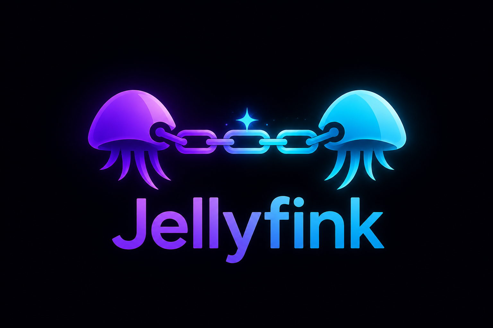

# Jellyfink



A Jellyfin server plugin that connects to one or more **remote Jellyfin servers** and makes their libraries browsable and playable on **your** server — without copying any media files. Metadata, artwork, and playback links are written locally; the remote stays the source of truth and streams on demand.

> **Requires Jellyfin 10.11 or later.**

---

## How it works

Jellyfink writes lightweight `.strm` files (stream links) and `.nfo` metadata files into a local folder you choose. Jellyfin treats these like any other library content: they appear on the home screen, are searchable, and play back through Jellyfink's proxy or directly from the remote.

**Nothing is downloaded except metadata and artwork.** Video never touches your disk unless you are proxying the stream, in which case it passes through memory and is never stored.

---

## Features

### Libraries
- Imports **Movies** and **TV/Anime** libraries from any number of remote Jellyfin servers.
- Uses the **remote's own metadata** — title, plot, year, genres, cast, ratings, artwork — so there are no internet lookups and no scraping delay.
- **Merge with a local library** — instead of creating a separate remote library, Jellyfink can add its content into an existing local library (see [Library merging](#library-merging) below).
- **Mirror remote collections** (box sets) and **playlists** locally.
- **Content filters** — import by year range, minimum community rating, or excluded genres.
- Per-server **item cap** and **streaming bitrate limit**.

### Playback
- **Proxy mode** — your server relays the stream (recommended; supports seek, works through any firewall).
- **Direct mode** — your client streams straight from the remote (lower server load; requires the client to reach the remote directly).
- **Auto-fallback** — optionally fall back to proxy when the remote is not directly reachable from the client.
- **Signed, credential-free stream links** — no remote password is ever written to disk or sent to clients. Links are HMAC-signed and resolve a fresh remote stream on play. Optional link expiry.

### Sync
- **Scheduled sync** — runs on a configurable interval (default 12 hours).
- **Delta sync** — after the first full sync, only re-processes movies or TV series that changed since the last run. Dramatically faster on large libraries.
- **Live sync** — optionally triggers a sync shortly after the remote reports a library change (WebSocket).
- **Targeted library scan** — after writing changes, only the affected Jellyfink folders are re-indexed, not your entire server.
- **Quiet hours** — suppress scheduled syncs during a configured time window.

### Watch state and metadata
- **Two-way watch state** — played status and resume positions sync from the remote. The newer timestamp wins on conflict.
- **Favorites** — optionally mirror favorite state from the remote.
- Configurable **"played" threshold** (default 90%).
- Per-server **user mapping** — assign a remote server's watch state to a specific local user account.

### Appearance
- Optional **"REMOTE" badge** stamped on library tiles so remote content is obvious on every client.
- Optional **server name prefix** or **custom prefix** for library names.
- **Manage library metadata settings** — prevents Jellyfin from re-scraping metadata that Jellyfink already wrote.

### Operations
- **Failure webhooks** — POST a message to a Discord or generic webhook on sync failure or unreachable server.
- **Stream audit log** — log every proxied stream request.
- **Configurable log rotation** (size and backup count).
- Per-server **online/offline health indicator** on the config page.
- Dedicated **`jellyfink.log`** in your Jellyfin log folder.

---

## Library merging

This is Jellyfink's most powerful feature. Instead of a separate "Remote Movies" library, you can point Jellyfink's imported content **into an existing local library**.

**Movies** — if a movie exists both locally and on the remote, Jellyfin presents them as **alternate versions** of the same item. On playback the user can pick which version to stream (e.g. local 1080p vs remote 4K).

**TV shows** — Jellyfin's automatic series grouping matches shows by provider ID (TheTVDB/TMDB). If you have Scrubs S1–S3 locally and the remote has S1–S6, the merged library shows all 6 seasons seamlessly. Local files back the episodes you own; `.strm` files back the rest. No duplicates, no manual cleanup.

To use merging, select a local library in the **"Merge into"** dropdown next to each remote library on the Servers tab.

---

## Install

### Via plugin catalog (recommended)

1. In Jellyfin: **Dashboard → Plugins → Repositories → ＋** and add:

   ```
   https://raw.githubusercontent.com/Capish85/jellyfink-releases/main/manifest.json
   ```

2. **Dashboard → Plugins → Catalog → Jellyfink → Install**, then **restart Jellyfin**.

Updates appear in the catalog automatically when a new version is published.

### Manual install

Download the latest `.zip` from [Releases](https://github.com/Capish85/jellyfink-releases/releases), extract `Jellyfin.Plugin.Jellyfink.dll` into your Jellyfin plugin folder, and restart.

---

## Quick start

1. Open **Dashboard → Plugins → Jellyfink**.
2. **Servers tab → Add server** — enter the remote server's URL and credentials (username/password or API key) → **Test connection**.
3. **Load libraries** — tick the libraries you want to import. Optionally pick a local library to merge into.
4. **Library tab** — set the **Library root folder** (where Jellyfink writes its files, e.g. `F:\Jellyfink`).
5. Set **This server's URL** to your server's externally reachable address so playback links resolve correctly for clients outside your LAN.
6. **Save and sync now**. The first sync can take a while for large libraries; after that, content appears on the home screen and plays normally.

**Tip:** Enable **Delta sync** (Advanced tab) after the first full sync. Subsequent syncs will be much faster since only changed content is re-processed.

---

## Notes

- Prefer an **API key** or a dedicated low-privilege remote account over your main admin password.
- Watch state is recorded on the remote against the account configured for that server.
- **Manage library metadata settings** is recommended — it prevents Jellyfin from overwriting the metadata Jellyfink wrote with internet lookups.
- When new content is added on the remote, Jellyfink scans only its own folders during the next sync — not your entire local library.

---

## Versions

See [Releases](https://github.com/Capish85/jellyfink-releases/releases) for the full changelog.